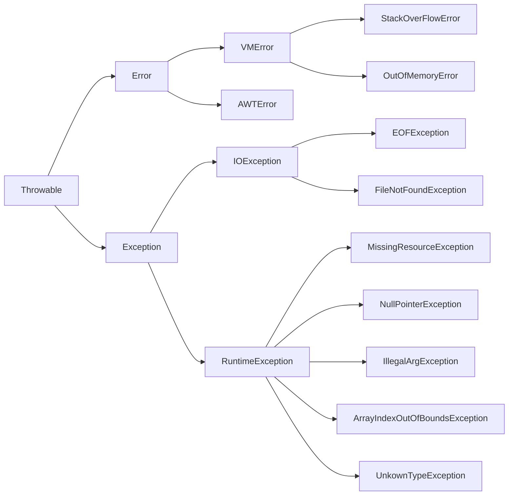

# `java` 的异常处理

## 异常

程序运行时，发生的不被期望的事件，这就是异常

异常阻止了程序按照程序员的预期正常执行

`Java` 的异常处理机制能在异常时，按预先设定的异常处理逻辑处理异常，让程序尽最大可能恢复正常并继续执行，且保持代码的清晰

`Java` 中的异常

- 语句执行时引发
- 通过throw 语句手动抛出
- 用对应类型的异常对象来封装异常
    - 对象只有是 `Throwable` 类才能被异常处理机制识别
- `JRE` 就会试图寻找**异常处理程序**来处理异常

## 异常类

`Throwable` 类是 ` Java` 异常类型的顶层父类



`Throwable`

- `Error`
    - `Error` 类以及他的子类的实例，代表了`JVM` 本身的错误
    - 错误不能被程序员通过代码处理
- `Exception`
    - 程序运行时发生的各种不期望发生的事件

`Javac` 对异常的处理要求，将异常类分为2类

- **非检查异常**（``unckecked exception`）：
    - `Error` 和 `RuntimeException` 以及他们的子类
    - `javac`在编译时，不会提示和发现这样的异常，不要求在程序处理这些异常
    - 对于这些异常，我们应该修正代码，而不是去通过异常处理器处理
    - 这样的异常发生的原因多半是代码写的有问题
        - 除`0`错误 `ArithmeticException`
        - 错误的强制类型转换错误 `ClassCastException`
        - 数组索引越界 `ArrayIndexOutOfBoundsException`
        - 使用了空对象 `NullPointerException`
- **检查异常**（checked exception）其它异常
    - `javac` 强制要求程序员为这样的异常做预备处理工作
        - 在方法中要么用 `try-catch`语句捕获它并处理
        - 要么用 `throws` 子句声明抛出它
        - 否则编译不会通过
    - 这样的异常一般是由程序的运行环境导致的
        - 因为程序可能被运行在各种未知的环境下
        - 而程序员无法干预用户如何使用他编写的程序
        - 于是程序员就应该为这样的异常时刻准备着
        - 如`SQLException` , `IOException`,``ClassNotFoundException` 等

## 初识异常

- 异常是在执行某个函数时引发的

    - 函数是层级调用，形成调用栈
    - 只要一个函数发生了异常，那么他的所有的caller都会被异常影响
    - 当这些被影响的函数以异常信息输出时，就形成的了**异常追踪栈**。

- 异常最先发生的地方，叫做**异常抛出点**

    - 当 `devide` 函数发生除0异常时
    - `devide` 函数抛出 `ArithmeticException` 异常
    - 调用他的 `CMDCalculate` 函数也无法正常完成，因此也发送异常
    - `CMDCalculate` 的 `caller` —— `main` 因为`CMDCalculate`抛出异常，也发生了异常
    - 这种行为叫做**异常的冒泡**
        - 为了在当前发生异常的函数或者这个函数的``caller`中找到最近的异常处理程序
        - 当函数中没有使用任何异常处理机制，
        - 异常最终由`main`函数抛给`JRE`，导致程序终止

- 这个异常是非检查异常

    - 不适用异常处理机制也可以顺利编译

- 但对于检查异常必须处理

    - 通过 `throws` 声明异常

        ```java
        public void testException() throws IOException {
            //FileInputStream的构造函数会抛出FileNotFoundException
            FileInputStream fileIn = new FileInputStream("E:\\a.txt");
        }
        ```

## 异常处理的基本语法

对于检查异常，有2种不同的处理方式

- 使用 `try...catch...finally` 语句块处理

- 在函数签名中使用 `throws` 声明交给函数调用者 `caller` 去解决

    ```java
    try{
        // try 可能发生异常的代码
        // 执行完 try 无异常，再执行finally块和finally后面的代码
        // 发生异常，匹配catch块
    } catch (SQLException SQLexception) {
        // catch 块捕获并处理一个特定的异常
        // JVM 使用这个catch块来处理异常    
    } catch(Exception exception) {
        // 如果try块中发生的异常在所有catch中都没捕获到
        // 则先去执行finally，然后到这个函数的外部caller中去匹配异常处理器
    } finally {
        // 无论异常是否发生，异常是否匹配被处理，finally都会执行
        // inally主要做一些清理工作，如流的关闭，数据库连接的关闭等
    }
    ```

- `java`中，异常处理的任务

    - 将执行控制流从异常发生的地方转移到能够处理这种异常的地方去
    - 异常被处理完后
        - 执行流会接着在“处理了这个异常的`catch`代码块”后面接着执行

- 异常处理策略

    - **resumption model of exception handling**（恢复式异常处理模式 ）
        - 异常处理后，控制流恢复到异常抛出点接着执行
    - **termination model of exception handling**（终结式异常处理模式）
        - 让执行流恢复到处理了异常的 `catch` 块后接着执行

### throws 函数声明

- `throws` 是另一种处理异常的方式
    - 仅仅将函数中可能出现的异常向调用者声明
- 原因
    - 方法本身不知道如何处理这样的异常
    - 让调用者处理更好
    - 用者需要为可能发生的异常负责

```java
public void foo() throws ExceptionType1 , ExceptionType2 ,ExceptionTypeN
{ 
     //foo内部可以抛出 ExceptionType1 , ExceptionType2
     // ExceptionTypeN 类的异常，或者他们的子类的异常对象
}
```

## finally块

只要对应的 `try` 执行了，则它一定也执行

在 `try` 块中打开资源，在 `finally` 块中清理释放这些资源

## throw 异常抛出语句

通过 `thorw` 手动显式的抛出一个异常

## 异常的链化

一个地方发生异常，将导致一连串的异常

异常的链化可以将多个模块的异常串联起来，使得异常信息不会丢失。

异常链化

- 以一个异常对象为参数构造新的异常对象
- 新的异常对象包含先前异常的信息
- 这个当做参数的异常，我们叫他根源异常（`cause`）

## 自定义异常

自定义异常扩展 `Exception` 类即可，因为 `Exception` 异常都属于检查异常（checked exception）

如果要自定义非检查异常，则扩展自 `RuntimeException`。


# [cpp异常详解](https://www.cnblogs.com/sld666666/p/4090418.html)

## 异常介绍

`CPP` 的错误的处理可以有两种方式， 1. 返回错误，2. 使用异常

`C++`中处理异常的过程：

- 在执行程序发生异常，可以不处理抛出一个错误信息
- 把它传递给上一级的函数来解决
- 上一级解决不了，再逐级上传
- 直到最高一级还无法处理的话，运行系统会自动调用系统函数 `terminate`
    - 由它调用abort终止程序
- 这样的异常处理方法使得异常引发和处理机制分离，而不在同一个函数中处理
- 这使得底层函数只需要解决实际的任务，而不必过多考虑对异常的处理
- 而把异常处理的任务交给上一层函数去处理

当异常发生时：

- 将产生中断
- 然后控制权转移给操作系统
- 操作系统调用异常处理器
- 它将从产生异常的函数开始检查函数调用序列
    - 然后执行栈展开
    - 并转移控制权
- 我们可以写自己的异常处理器
    - 然后注册到操作系统
    - 这样当异常事件发生时，操作系统会调用它


- 编译器使用 `EBP` 寄存器来标识当前活动栈帧

    - 函数通过偏移这个帧指针来获取局部变量
    - 编译阶段，编译器将局部变量的名称绑定到相对于帧指针的一个固定偏移值
    - 例如
        - `widget`函数的一个局部变量
        - 会通过栈指针向下偏移固定字节数来访问
        - 称作 `EBP-24`

- ESP寄存器，它是栈指针，指向栈的最后一个数据

    - 这个例子中，`ESP`指向 `widget` 帧的尾部
    - 下一个帧会在这个位置创建

- 当编译器编译函数时

    - 它会在函数开始的地方加入一些代码，称作**初始化段**（*prologue*）

        - 负责创建并初始化函数的栈帧
        - 初始化段的行为
            - 第一把当前帧指针 `EBP` 保存到栈上
            - 第二通过修改调用函数帧位置的 `EBP` 寄存器，激活被调用函数的帧
            - 第三将ESP寄存器移动到当前帧的尾部
                - 通过把ESP减去函数所创建的所有局部变量与中间值的大小
                - 在编译阶段，编译器知道函数的所有局部变量的类型与大小，因此它能够计算出帧的大小

    - 编译器在函数尾部也添加一些代码，称作**清理段（epilogue）**

        - 负责弹出当前函数的栈帧
        - 清理段的行为
            - 它将调用函数保存的帧指针恢复到 `ESP`
                - 即被调用函数帧指针指向的位置
                - 将它弹出到 `EBP`，因此激活了调用函数的栈帧
                - 然后执行 `ret` 指令

    - `VC++`为每个函数创建一个``EXCEPTION_REGISTRATION`结构体，作为函数的局部变量

        - 当 `VC++` 编译一个函数时，它会为函数生成两类数据
            - 异常回调函数
            - 包含函数重要信息的数据结构 `funcinfo`
                - 如catch块
                - catch希望接收的异常类型信息等

    - 包含异常处理代码的结构

        

        - `Widget`函数的异常回调函数位于异常链的头部
            - `FS:[0]` 指向它（在 `widget` 函数的初始化段设置）
            - 异常处理器将 `widget` 函数的 `funcinfo` 结构体地址传递给 ``__CxxFrameHandler` 函数
                - 此函数检测这个数据结构，查看是否有希望接收当前异常类型的 `catch` 块
                - 如果没有发现，它把 `ExceptionContinueSearch` 值返回给操作系统
                - 操作系统从异常处理链中取出下一个节点，然后调用其异常处理器
                    - 即当前函数的调用者的处理器
                - 这个过程一直持续到异常处理器找到了能够接收当前异常的 `catch` 块
                    - 种情况下它不会将控制权返回给操作系统
                - 在调用 `catch` 块之前（它能够从 `funcinfo` 结构体获取到 `catch`块的地址，见上图）
                    - 异常处理器必须执行栈展开
                    - 清理这个函数帧之下的所有函数的栈帧
                    - 清理栈帧的过程有些复杂
                        - 异常处理器必须找到异常发生时函数帧上所有存活的局部变量
                            - 然后调用它们的析构器

