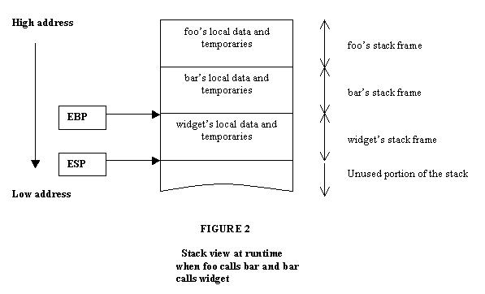

# `java` 的异常处理

## 异常

程序运行时，发生的不被期望的事件，这就是异常

异常阻止了程序按照程序员的预期正常执行

`Java` 的异常处理机制能在异常时，按预先设定的异常处理逻辑处理异常，让程序尽最大可能恢复正常并继续执行，且保持代码的清晰

`Java` 中的异常

- 语句执行时引发
- 通过throw 语句手动抛出
- 用对应类型的异常对象来封装异常
    - 对象只有是 `Throwable` 类才能被异常处理机制识别
- `JRE` 就会试图寻找**异常处理程序**来处理异常

## 异常类

`Throwable` 类是 ` Java` 异常类型的顶层父类


`Throwable`

- `Error`
    - `Error` 类以及他的子类的实例，代表了`JVM` 本身的错误
    - 错误不能被程序员通过代码处理
- `Exception`
    - 程序运行时发生的各种不期望发生的事件

`Javac` 对异常的处理要求，将异常类分为2类

- **非检查异常**（`unckecked exception`）：
    - `Error` 和 `RuntimeException` 以及他们的子类
    - `javac`在编译时，不会提示和发现这样的异常，不要求在程序处理这些异常
    - 对于这些异常，我们应该修正代码，而不是去通过异常处理器处理
    - 这样的异常发生的原因多半是代码写的有问题
        - 除`0`错误 `ArithmeticException`
        - 错误的强制类型转换错误 `ClassCastException`
        - 数组索引越界 `ArrayIndexOutOfBoundsException`
        - 使用了空对象 `NullPointerException`
- **检查异常**（checked exception）其它异常
    - `javac` 强制要求程序员为这样的异常做预备处理工作
        - 在方法中要么用 `try-catch`语句捕获它并处理
        - 要么用 `throws` 子句声明抛出它
        - 否则编译不会通过
    - 这样的异常一般是由程序的运行环境导致的
        - 因为程序可能被运行在各种未知的环境下
        - 而程序员无法干预用户如何使用他编写的程序
        - 于是程序员就应该为这样的异常时刻准备着
        - 如`SQLException` , `IOException`,``ClassNotFoundException` 等

## 初识异常

- 异常是在执行某个函数时引发的

    - 函数是层级调用，形成调用栈
    - 只要一个函数发生了异常，那么他的所有的caller都会被异常影响
    - 当这些被影响的函数以异常信息输出时，就形成的了**异常追踪栈**。

- 异常最先发生的地方，叫做**异常抛出点**

    - 当 `devide` 函数发生除0异常时
    - `devide` 函数抛出 `ArithmeticException` 异常
    - 调用他的 `CMDCalculate` 函数也无法正常完成，因此也发送异常
    - `CMDCalculate` 的 `caller` —— `main` 因为`CMDCalculate`抛出异常，也发生了异常
    - 这种行为叫做**异常的冒泡**
        - 为了在当前发生异常的函数或者这个函数的``caller`中找到最近的异常处理程序
        - 当函数中没有使用任何异常处理机制，
        - 异常最终由`main`函数抛给`JRE`，导致程序终止

- 这个异常是非检查异常

    - 不适用异常处理机制也可以顺利编译

- 但对于检查异常必须处理

    - 通过 `throws` 声明异常

        ```java
        public void testException() throws IOException {
            //FileInputStream的构造函数会抛出FileNotFoundException
            FileInputStream fileIn = new FileInputStream("E:\\a.txt");
        }
        ```

## 异常处理的基本语法

对于检查异常，有2种不同的处理方式

- 使用 `try...catch...finally` 语句块处理

- 在函数签名中使用 `throws` 声明交给函数调用者 `caller` 去解决

    ```java
    try{
        // try 可能发生异常的代码
        // 执行完 try 无异常，再执行finally块和finally后面的代码
        // 发生异常，匹配catch块
    } catch (SQLException SQLexception) {
        // catch 块捕获并处理一个特定的异常
        // JVM 使用这个catch块来处理异常    
    } catch(Exception exception) {
        // 如果try块中发生的异常在所有catch中都没捕获到
        // 则先去执行finally，然后到这个函数的外部caller中去匹配异常处理器
    } finally {
        // 无论异常是否发生，异常是否匹配被处理，finally都会执行
        // inally主要做一些清理工作，如流的关闭，数据库连接的关闭等
    }
    ```

- `java`中，异常处理的任务

    - 将执行控制流从异常发生的地方转移到能够处理这种异常的地方去
    - 异常被处理完后
        - 执行流会接着在“处理了这个异常的`catch`代码块”后面接着执行

- 异常处理策略

    - **resumption model of exception handling**（恢复式异常处理模式 ）
        - 异常处理后，控制流恢复到异常抛出点接着执行
    - **xtermination model of exception handling**（终结式异常处理模式）
        - 让执行流恢复到处理了异常的 `catch` 块后接着执行

### throws 函数声明

- `throws` 是另一种处理异常的方式
    - 仅仅将函数中可能出现的异常向调用者声明
- 原因
    - 方法本身不知道如何处理这样的异常
    - 让调用者处理更好
    - 用者需要为可能发生的异常负责

```java
public void foo() throws ExceptionType1 , ExceptionType2 ,ExceptionTypeN
{ 
     //foo内部可以抛出 ExceptionType1 , ExceptionType2
     // ExceptionTypeN 类的异常，或者他们的子类的异常对象
}
```

## finally块

只要对应的 `try` 执行了，则它一定也执行

在 `try` 块中打开资源，在 `finally` 块中清理释放这些资源

## throw 异常抛出语句

通过 `thorw` 手动显式的抛出一个异常

## 异常的链化

一个地方发生异常，将导致一连串的异常

异常的链化可以将多个模块的异常串联起来，使得异常信息不会丢失。

异常链化

- 以一个异常对象为参数构造新的异常对象
- 新的异常对象包含先前异常的信息
- 这个当做参数的异常，我们叫他根源异常（`cause`）

## 自定义异常

自定义异常扩展 `Exception` 类即可，因为 `Exception` 异常都属于检查异常（checked exception）

如果要自定义非检查异常，则扩展自 `RuntimeException`。


# [cpp 的异常处理机制实现](https://www.cnblogs.com/sld666666/p/4090418.html)

## 异常介绍

`CPP` 的错误的处理可以有两种方式， 1. 返回错误，2. 使用异常

`C++`中处理异常的过程：

- 在执行程序发生异常，可以不处理抛出一个错误信息
- 把它传递给上一级的函数来解决
- 上一级解决不了，再逐级上传
- 直到最高一级还无法处理的话，运行系统会自动调用系统函数 `terminate`
    - 由它调用 `abort` 终止程序
- 这样的异常处理方法使得异常引发和处理机制分离，而不在同一个函数中处理
- 这使得底层函数只需要解决实际的任务，而不必过多考虑对异常的处理
- 而把异常处理的任务交给上一层函数去处理

当异常发生时：

- 将产生中断
- 然后控制权转移给操作系统
- 操作系统调用异常处理器
- 它将从产生异常的函数开始检查函数调用序列
    - 然后执行栈展开
    - 并转移控制权
- 我们可以写自己的异常处理器
    - 然后注册到操作系统
    - 这样当异常事件发生时，操作系统会调用它



- 编译器使用 `EBP` 寄存器来标识当前活动栈帧

    - 函数通过偏移这个帧指针来获取局部变量
    - 编译阶段，编译器将局部变量的名称绑定到相对于帧指针的一个固定偏移值
    - 例如
        - `widget`函数的一个局部变量
        - 会通过栈指针向下偏移固定字节数来访问
        - 称作 `EBP-24`

- ESP寄存器，它是栈指针，指向栈的最后一个数据

    - 这个例子中，`ESP`指向 `widget` 帧的尾部
    - 下一个帧会在这个位置创建

- 当编译器编译函数时

    - 它会在函数开始的地方加入一些代码，称作**初始化段**（*prologue*）

        - 负责创建并初始化函数的栈帧
        - 初始化段的行为
            - 第一把当前帧指针 `EBP` 保存到栈上
            - 第二通过修改调用函数帧位置的 `EBP` 寄存器，激活被调用函数的帧
            - 第三将ESP寄存器移动到当前帧的尾部
                - 通过把ESP减去函数所创建的所有局部变量与中间值的大小
                - 在编译阶段，编译器知道函数的所有局部变量的类型与大小，因此它能够计算出帧的大小

    - 编译器在函数尾部也添加一些代码，称作**清理段（epilogue）**

        - 负责弹出当前函数的栈帧
        - 清理段的行为
            - 它将调用函数保存的帧指针恢复到 `ESP`
                - 即被调用函数帧指针指向的位置
                - 将它弹出到 `EBP`，因此激活了调用函数的栈帧
                - 然后执行 `ret` 指令

    - `VC++`为每个函数创建一个``EXCEPTION_REGISTRATION`结构体，作为函数的局部变量

        - 当 `VC++` 编译一个函数时，它会为函数生成两类数据
            - 异常回调函数
            - 包含函数重要信息的数据结构 `funcinfo`
                - 如catch块
                - catch希望接收的异常类型信息等

    - 包含异常处理代码的结构

        

        - `Widget`函数的异常回调函数位于异常链的头部
            - `FS:[0]` 指向它（在 `widget` 函数的初始化段设置）
            - 异常处理器将 `widget` 函数的 `funcinfo` 结构体地址传递给 ``__CxxFrameHandler` 函数
                - 此函数检测这个数据结构，查看是否有希望接收当前异常类型的 `catch` 块
                - 如果没有发现，它把 `ExceptionContinueSearch` 值返回给操作系统
                - 操作系统从异常处理链中取出下一个节点，然后调用其异常处理器
                    - 即当前函数的调用者的处理器
                - 这个过程一直持续到异常处理器找到了能够接收当前异常的 `catch` 块
                    - 种情况下它不会将控制权返回给操作系统
                - 在调用 `catch` 块之前（它能够从 `funcinfo` 结构体获取到 `catch`块的地址，见上图）
                    - 异常处理器必须执行栈展开
                    - 清理这个函数帧之下的所有函数的栈帧
                    - 清理栈帧的过程有些复杂
                        - 异常处理器必须找到异常发生时函数帧上所有存活的局部变量
                            - 然后调用它们的析构器

# python 让函数返回结果的技巧

### 抛出异常，而不是返回结果与错误

比如下面的代码，`create_item()` 函数返回 `item` 和 `errmsg`

```python
def create_item(name):
    if len(name) > MAX_LENGTH_OF_NAME:
        return None, 'name of item is too long'
    if len(CURRENT_ITEMS) > MAX_ITEMS_QUOTA:
        return None, 'items is full'
    return Item(name=name), ''
```

调用函数：

```python
item, errmsg = create_item(name)
if errmsg:
    print(f'create item failed: {err_msg}')
else:
    print(f'item<{name}> created')
```

这种模式的多层调用会增加方法处理错误的成本。 `python` 更鼓励**使用异常来进行错误流程处理**

引入异常之后的代码重构：

- 创建一个异常的基础类

    ```python
    class CreateItemError(Exception):
        """创建 Item 失败的异常"""
        pass
    ```

- 重构 `create_item()` 函数

    ```python
    def create_item(name):
        if len(name) > MAX_LEN_OF_NAME:
            raise CreateItemError("name of item is too long")
        if len(CURRENT_ITEMS) > MAX_ITEMS_QUOTA:
            raise CreateItemmError("items is full")
        
        return Item(name=name)
    ```

- 调用 `create_item()` 函数

    ```python
    try:
        item = create_item(name)
    except CreateItemError as e:
        print(f'创建项目失败:{e.errmsg}')
    else:
        print(f'item<{name}> created!')
    ```

    抛出异常和 `(item, errmsg)` 的区别：

    - 只返回 `Item` 类型或引发异常
    - 异常在捕获前会不断往**调用栈**上层报，所以调用方可以不处理异常，由上层处理
    - 文档必须说明要抛出的异常类型

### python 中对返回 None 的约定

`None` 通常表示**应该存在但是缺失的东西**。 `python` 中函数返回 `None` 通常有以下 3 中情况：

1. 默认返回值

    对于没有返回值的操作型函数，比如 `list.append()`

2. 意料之中的可能没有的值

    调用函数就是让它去尝试做某件事情，比如 `re.search`

3. 作为调用失败时表示错误结果的值

    比如 `c` 语言常用的返回 `-1` 的情况

对于情况 `3` 不同的语言有不同的倾向（用异常还是返回值），在 `python` 中关键在：**函数名称与 None 之间是否有一种意料之中的暗示**(*“拿不到任何结果”是否是该函数名称含义里的一部分*)

比如：

- `re.search()` 是有可能没有结果的，所以可以返回 `None`
- `create_user_from_name()` 不适合返回 `None`，要坚持用 `None`，改名为：`create_user_or_none()`明示

对于 `create_user_from_name()`，在 `python` 中应该用抛出异常来代替 `None`。**因为返回不了正常结果不是函数意义的一部分**，这就代表函数出现了**意料之外**的状况，而且还可以在异常中包含抛出异常的原因，这是 `None` 做不到的。

# Python 的异常处理

异常处理工作由“捕获”和“抛出”两部分组成

捕获”指的是使用 `try ... except` 包裹特定语句，妥当的完成错误流程处理。而恰当的使用 `raise` 主动“抛出”异常，更是优雅代码里必不可少的组成部分。

`python` 把错误分成两种：*语法错误* 和 *异常*

## 语法错误

也成为**解析错误**，语法的错误是由某个 `token` 引起或在这里被检测出错误。比如：

```python
while True print("Hello")
   		   ^
```

在 `print` 这个 `token`  处检测到了错误

## 异常

`python` 中的异常是指在执行时引发的错误。执行过程中没有被程序处理的异常会引发如下的错误信息：

```python
>>> 10 * (1/0)
Traceback (most recent call last):
  File "<stdin>", line 1, in <module>
ZeroDivisionError: division by zero
```

- 异常类型

    这里的 `ZeroDivisionError: division by zero` 说明执行中检查到了 `ZeroDivisionError` 类型的错误。并且 `python` 根据异常的类型还提供了这种异常类型的详细说明：`division by zero`

- 异常发生的现场环境（上下文）

    异常信息的前面，`python` 以堆栈回溯的形式显示发生异常时的现场（上下文）

### python 内置异常

在 Python 中，所有异常都派生自 [`BaseException`](https://docs.python.org/zh-cn/3.8/library/exceptions.html#BaseException) 的类的实例。而且内置异常都会具有一个提示导致错误详细原因的“关联值”，关联值通常会作为参数被传递给异常类的构造器

当在 [`except`](https://docs.python.org/zh-cn/3.8/reference/compound_stmts.html#except) 或 [`finally`](https://docs.python.org/zh-cn/3.8/reference/compound_stmts.html#finally) 子句中引发（或重新引发）异常时，`__context__` 会被自动设为所捕获的最后一个异常；如果新的异常未被处理，则最终显示的回溯信息将包括**原始的异常**和**最后的异常**。

当引发一个新的异常时，隐式的异常上下文可以通过使用带有 [`raise`](https://docs.python.org/zh-cn/3.8/reference/simple_stmts.html#raise) 的 [`from`](https://docs.python.org/zh-cn/3.8/reference/simple_stmts.html#from) 来补充一个显式的原因:

```python
raise new_exc from origin_exc
```

跟在 [`from`](https://docs.python.org/zh-cn/3.8/reference/simple_stmts.html#from) 之后的表达式必须为一个异常或 `None`。 它将在所引发的异常上被设置为 `__cause__`。让旧异常在 `__context__` 中保持可用状态以便在调试时进行内省

```

@startmindmap
* BaseException
++ SystemExit
++ KeyboardInterrupt
++ GeneratorExit
++ Exception
+++_ StopIteration
+++_ StopAsyncIteration
+++_ ArithmeticError
++++_ FloatingPointError
++++_ OverflowError
++++_ ZeroDivisionError
+++_ AssertionError
+++_ AttributeError
+++_ BufferError
+++_ EOFError
+++_ ImportError
++++_ ModuleNotFoundError
+++_ LookupError
++++_ IndexError
++++_ KeyError
+++_ MemoryError
+++_ NameError
++++_ UnboundLocalError
+++_ OSError
++++_ BlockingIOError
++++_ ChildProcessError
++++_ ConnectionError
+++++_ BrokenPipeError
+++++_ ConnectionAbortedError
+++++_ ConnectionRefusedError
+++++_ ConnectionResetError
++++_ FileExistsError
++++_ FileNotFoundError
++++_ InterruptedError
++++_ IsADirectoryError
++++_ NotADirectoryError
++++_ PermissionError
++++_ ProcessLookupError
++++_ TimeoutError
+++_ ReferenceError
+++_ RuntimeError
++++_ NotImplementedError
++++_ RecursionError
+++_ SyntaxError
++++_ IndentationError
+++++_ TabError
+++_ SystemError
+++_ TypeError
+++_ ValueError
++++_ UnicodeError
+++++_ UnicodeDecodeError
+++++_ UnicodeEncodeError
+++++_ UnicodeTranslateError
+++_ Warning
++++_ DeprecationWarning
++++_ PendingDeprecationWarning
++++_ RuntimeWarning
++++_ SyntaxWarning
++++_ UserWarning
++++_ FutureWarning
++++_ ImportWarning
++++_ UnicodeWarning
++++_ BytesWarning
++++_ ResourceWarning
@endmindmap

```

## 处理异常

### `try` 的工作原理

- 执行 *try 子句*

- `except`

    - 如果没有异常发生，则跳过 *except 子句* 

    - 发生了异常

        - 则跳过该子句中剩下的部分

        - `except` 异常匹配

            - 异常的类型和 [`except`](https://docs.python.org/zh-cn/3.8/reference/compound_stmts.html#except) 关键字后面的异常匹配

                - 执行 except 子句
                - 继续执行 [`try`](https://docs.python.org/zh-cn/3.8/reference/compound_stmts.html#try) 语句之后的代码

            - 不匹配

                - 将异常传递到外部的 [`try`](https://docs.python.org/zh-cn/3.8/reference/compound_stmts.html#try) 语句中
                - 如果没有找到处理程序
                    - 是一个 *未处理异常*
                    - 执行将停止并显示堆栈回溯消息

            - 规则

                - `except` 匹配类和它的基础类 
                    - 比如 `class B(A)`， `class A`
                    - `except B`：可以匹配类 `B` 和它的基础类 `A`

            - 可以在`except`处理端中打印错误消息，然后重新引发异常

                ```python
                import sys
                
                try:
                    f = open('myfile.txt')
                    s = f.readline()
                    i = int(s.strip())
                except OSError as err:
                    print("OS error: {0}".format(err))
                except ValueError:
                    print("Could not convert data to an integer.")
                except:
                    print("Unexpected error:", sys.exc_info()[0])
                    raise
                ```

- `else`

    - 当 `except`没有出现时，执行 `else`

        ```python
        for arg in sys.argv[1:]:
            try:
                f = open(arg, "r")
            except OSError:
                print("不能打开", arg)
            else:
                print(arg, 'has', len(f.readlines()), 'lines')
                f.close()
        ```

### 异常参数

异常的关联值，也称为异常 *参数* 

`except`子句可以在异常名称后面指定一个变量。这个变量和一个异常实例绑定，它的参数存储在 `instance.args` 中。

```python
try:
    raise Exception("参数1", "参数2")
except Exception as inst:
    print(type(inst))	# <class 'Exception'>
    print(inst.args)   	# ('参数1', '参数2')
    print(inst)			# ('参数1', '参数2')
    x, y = inst.args	
    print("x = ", x)	# x =  参数1
    print("y = ", y)	# y =  参数2

```

### 异常中的异常

异常处理程序不仅处理 try 子句中遇到的异常，还处理 try 子句中调用（即使是间接地）的函数内部发生的异常

```python
def div_zero():
    x = 1 / 0
    
try:
    div_zero()
except ZeroDivisionError as err:
    print("处理除0异常")
```

## 抛出异常

`raise`  直接引发异常

```python
raise NameError("名字不对")
>>> NameError：名字不对
```

[`raise`](https://docs.python.org/zh-cn/3.8/reference/simple_stmts.html#raise) 唯一的参数就是要抛出的异常。如果 `raise ValueError` 参数是一个类，它会隐式实例化:

```python
raise ValueError  # 相当于 raise ValuleError()
```

我们可以接收异常后，不处理再已发

```python
try:
    raise NameError("名字")
except NameError:
    print("突然出现了一个异常")
    raise
```

结果：

```bash
突然出现了一个异常
Traceback (most recent call last):
  File "<stdin>", line 2, in <module>
NameError: 名字
```

## 用户自定义异常

自定义异常通常直接或间接地从 [`Exception`](https://docs.python.org/zh-cn/3.8/library/exceptions.html#Exception) 类派生

- 定义一个自己的异常类

    ```python
    class Error(Exception):
        """当前模块的异常基础类"""
        pass
    ```

- 创建子异常类针对不同的异常条件

    - 输入异常

        ```python
        class InputError(Error):
            def __init__(self, expr, message):
                self.expr = expr
                self.message = message
        ```

## [定义清理操作](https://docs.python.org/zh-cn/3.8/tutorial/errors.html#defining-clean-up-actions)

`finally` 用于定义必须在所有情况下执行的清理操作

```python
try:
    raise KeyboardInterrupt
finally:
    print("Good bye")
```

`finally` 子句作为 [`try`](https://docs.python.org/zh-cn/3.8/reference/compound_stmts.html#try) 语句结束前的最后一项任务被执行，不论 `try` 语句是否产生了异常都会被执行

`finally` 的机制：

- 在执行 `try` 子句期间发生了异常，但没有被某个 `except` 子句所处理

    - 则该异常会在 `finally` 子句执行**之后**被**重新引发**

- 异常也可能在 `except` 或 `else` 子句执行期间发生

    -  同样地，该异常会在 `finally` 子句执行**之后**被**重新引发**

- 在执行 `try` 语句时遇到一个 [`break`](https://docs.python.org/zh-cn/3.8/reference/simple_stmts.html#break), [`continue`](https://docs.python.org/zh-cn/3.8/reference/simple_stmts.html#continue) 或 [`return`](https://docs.python.org/zh-cn/3.8/reference/simple_stmts.html#return) 语句

    - 则 `finally` 子句将在执行它们之前被执行

- 如果 `finally` 子句中包含一个 `return` 语句

    - 则返回值将来自 `finally` 的某个 `return` 语句的返回值
    - 而非来自 `try` 子句的 `return` 语句的返回值

    ```python
    def return_bool():
        try:
            return True
        finally:
            return False
    ```

    结果：

    ```bash
    >>> return_bool()
    False
    ```

    在实际应用程序中，[`finally`](https://docs.python.org/zh-cn/3.8/reference/compound_stmts.html#finally) 子句对于释放外部资源（例如文件或者网络连接）非常有用，无论是否成功使用资源。

# Java 的异常

当程序违反了 `Java` 编程语言的语义约束时，`Java` 虚拟机将此错误作为异常向程序发出信号

面对**违规行为**的处理（一个例子是试图在数组的边界之外建立索引）

- `abort` 强制性地终止程序
    - 一些编程语言和它们的实现对这种错误的反应是强制性地终止程序
- 以不可预测行为继续
    - 另一些编程语言允许实现以任意或不可预测的方式作出反应
- Java
    - 这两种方法都不符合 `Java SE` 平台的设计目标：提供可移植性和健壮性
    - `Java` 规定，当语义约束被违反时，将抛出一个异常
    - 并将控制权从异常发生点转移到程序员指定的地方
    - 程序也可以使用 `throw` 语句显式地抛出异常
        - 显式使用 `throw` 语句提供了一种替代方法
            - 即通过返回值来表达错误条件的老式风格
            - 这种值经常被调用者忽略或不检查
            - 导致程序不健壮，表现出不理想的行为

每个异常都由 `Throwable` 类或它的一个子类的实例来表示。这样的对象可以用来将信息从异常发生点携带到捕获它的处理程序。处理程序由 `try` 语句的 `catch` 子句建立

在抛出异常的过程中，``JVM` 会立刻逐一跳过当前线程中已经开始但未完成执行的任何表达式、语句、方法和构造函数调用、初始化器和字段初始化表达式。这个过程一直持续到找到一个处理程序。如果没有找到这样的处理程序，那么该异常可能会被不捕获异常的上级处理程序所处理。因此，我们会尽一切努力避免让异常得不到处理。

## 异步异常

大多数异常都是由于发生异常的线程操作而同步发生的，并且是在程序中指定可能导致这种异常的某个点发生的。而异步异常则是指在程序执行过程中的任何一点都有可能发生的异常。

异步异常的发生只是由于:

- `stop` 方法的调用。
- `JVM` 内部错误或资源限制，使其无法实现 `Java` 编程语言的语义。在这种情况下，抛出的异步异常是`VirtualMachineError`子类的一个实例

`Java SE` 平台允许在抛出异步异常之前发生少量但有约束的执行。

异步异常很少见，但如果要生成高质量的机器代码，正确理解它们的语义是必要的。

上面提到的延迟是允许的，以允许优化的代码在遵守Java编程语言语义的同时，在实际处理这些异常的点检测和抛出这些异常。一个简单的实现可能会在每个控制转移指令的点上轮询异步异常。由于程序的大小是有限的，这就为检测异步异常的总延迟提供了一个约束。由于在控制转移之间不会发生异步异常，因此代码生成器有一定的灵活性，可以在控制转移之间重新排序计算，以获得更高的性能。

## 异常的编译期检查

方法或构造函数的执行时可能产生异常。这种编译期检查异常处理程序的存在是为了减少没有被正确处理的异常的数量。

## 异常检测

如果一个方法或构造函数体可以抛出一些异常类 `E`，而 `E` 是一个检查异常类，并且 `E` 不是该方法或构造函数的 `throws` 子句中声明的某个类的子类，那么这是一个编译时错误。

如果一个 `lambda` 体可以抛出一些异常类E，当E是一个被检查的异常类，并且E不是lambda表达式所针对的函数类型的throws子句中声明的某个类的子类时，这是一个编译时错误。

如果一个命名类或接口的类变量初始化器或静态初始化器(§8.7)可以抛出一个检查的异常类，那么这是一个编译时错误。

如果一个命名类的实例变量初始化器(§8.3.2)或实例初始化器(§8.6)可以抛出一个检查过的异常类，这是一个编译时错误，除非命名类至少有一个显式声明的构造函数，并且异常类或它的一个超类在每个构造函数的throws子句中显式声明。

## 掌握Python异常处理

### 只做最精确的异常捕获

异常捕获的目的，不是去捕获尽可能多的异常。我们从一开始就坚持：**只做最精准的异常捕获**：

- 永远只捕获那些可能会抛出异常的语句块
- 尽量只捕获精确的异常类型，而不是模糊的 `Exception`

### 别让异常破坏抽象一致性

- 让模块只抛出与当前抽象层级一致的异常
    - 比如 `image.processer` 模块应该抛出自己封装的 `ImageOpenError` 异常
- 在必要的地方进行异常包装与转换
    - 应该在贴近高层抽象（视图 View 函数）的地方，将图像处理模块的 `ImageOpenError` 低级异常包装转换为 `APIErrorCode` 高级异常

在文件 `proj/util/image/processor.py` 中：

```python
# 定义本模块的异常类
class ImgOpenError(Exception):
    pass

def process_image():
    try:
        image = Image.open(fp)
    except Exception as e:
        raise ImgOpenError(exc=e)
```

在 `proj/app/views.py` 文件中：

```python
def view_func():
    try:
        process_image(fp)
    except ImgOpenError:
        raise error.INVALID_IMG_UPLOADED
```

除了应该避免抛出**高于**当前抽象级别的异常外，我们同样应该避免泄露**低于**当前抽象级别的异常

比如 `requests` 模块，它请求页面出错时所抛出的异常，并不是它在底层所使用的 `urllib3` 模块的原始异常，而是通过 `requests.exceptions` 包装过一次的异常。

这样做同样是为了保证异常类的抽象一致性。因为 urllib3 模块是 requests 模块依赖的底层实现细节，而这个细节有可能在未来版本发生变动。所以必须对它抛出的异常进行恰当的包装，避免未来的底层变更对 `requests` 用户端错误处理逻辑产生影响。

### 异常处理不应该喧宾夺主

异常捕获要精准、抽象级别要一致。但是**异常处理逻辑太多，扰乱了代码核心逻辑**

比如一个处理用户上传头像的视图函数。这个函数针对每件事都做了异常捕获。如果做某件事时发生了异常，就返回对用户友好的错误到前端。

```python
def upload_avatar(request):
    """用户上传新头像"""
    try:
        avatar_file = request.FILES['avatar']
    except KeyError:
        raise error_codes.AVATAR_FILE_NOT_PROVIDED

    try:
       resized_avatar_file = resize_avatar(avatar_file)
    except FileTooLargeError as e:
        raise error_codes.AVATAR_FILE_TOO_LARGE
    except ResizeAvatarError as e:
        raise error_codes.AVATAR_FILE_INVALID

    try:
        request.user.avatar = resized_avatar_file
        request.user.save()
    except Exception:
        raise error_codes.INTERNAL_SERVER_ERROR
    return HttpResponse({})
```

Python 语言提供了对付这类场景的工具：“上下文管理器（context manager）”，它配合 `with` 语句可以改善处理流程：

- 创建一个环境管理器 `raise_api_error`

    ```python
    class raise_api_error:
        def __init__(self, captures, code_name):
            self.captures = captures
            self.code = getattr(error_codes, code_name)
            
        def __enter__(self):
            # 进入环境管理器
            return self
       
    	def __exit__(self, exc_type, exc_val, exc_tb):
            # 退出
            # 环境抛出的
            # 异常类型、异常值、错误栈
            if exc_type is None:
                return False
            if exc_type == self.captures:
                raise self.code from exc_val
            return False
    ```

    在退出上下文时，会判断当前上下文中是否抛出了类型为 `self.captures` 的异常，如果有，就用 `APIErrorCode` 异常类替代它

- 使用环境管理器

    ```python
    def upload_avatar(request):
        with raise_api_error(KeyError, "AVATAR_FILE_NOT_PROVIDED"):
            avatar_file = request.FILES["avatar"]
        with raise_api_error(ResizeAvatarError, "AVATAR_FILE_INVALID"), \
        		raise_api_error(FileTooLargeError, "AVATAR_FILE_TOO_LARGE"):
                resized_avatar_file = resize_avatar(avatar_file)
        with raise_api_error(Exception, "INTERNAL_SERVER_ERROR"):
            request.user.avatar = resized_avatar_file
            request.user.save()
        return HttpResponse({})
    ```

    

# 附录

## raise 和 raise from 的区别

`raise … from …` 会为异常对象设置 `__cause__` 属性表明异常的是由谁直接引起的。

处理异常时发生了新的异常，在不使用 `from` 时更倾向于新异常与正在处理的异常没有关联。

而 `from` 则是能指出新异常是因旧异常直接引起的。这样的异常之间的关联有助于后续对异常的分析和排查。`from` 语法会有个限制，就是第二个表达式必须是另一个异常类或实例

比如：

```python
try:
    print(1 / 0)
except Exception as exc:
    raise RuntimeError("自定义的 Runtime 异常")
```

结果：

```bash
Traceback (most recent call last):
  File "test4.py", line 2, in
    print(1 / 0)
ZeropisionError: pision by zero
 
#在处理上述异常的过程中，又发生了另一个异常情况
During handling of the above exception, another exception occurred:

Traceback (most recent call last):
  File "test4.py", line 4, in
    raise RuntimeError("自定义的 Runtime 异常")
RuntimeError: 自定义的 Runtime 异常
```

如果把 `raise` 改成 `raise ... from ...`

```python
try:
    print(1 / 0)
except Exception as exc:
    raise RuntimeError("自定义的 Runtime 异常") from exc
```

结果

```bash
Traceback (most recent call last):
  File "test4.py", line 2, in
    print(1 / 0)
ZeropisionError: pision by zero

上述异常是造成以下异常的直接原因
The above exception was the direct cause of the following exception:
 
Traceback (most recent call last):
  File "test4.py", line 4, in
    raise RuntimeError("自定义的 Runtime 异常") from exc
RuntimeError: 自定义的 Runtime 异常
```

## python 的路径

应该用 `python -m xxx` 来执行 `xxx` 模块。这样 `xxx.py`  中的 `__name__` 和 `__package__` 都包含系统路径，这样在 `xxx.py` 中就可以通过相对路径 `.module` 来引用同级的 `module` 模块以及下一级的模块

如果要引用上一级的模块，就需要 `python -m foo.xxx` 来执行模块，这样和 `foo` 统计的路径就可以包含到 `__x__` 的 `__package__` 中

示例

```bash
$ tree

sysroot
├── pkg1
│   ├── a.py
│   ├── b.py
│   ├── c.py
└── pkg2
    ├── d.py
    ├── e.py
```

- `pkg1/a.py`

    ```python
    print(f"[file]: name: [{__name__}], package: [{__package__}]")
    
    if __name__ == "__main__":
        print("这是 pkg1.a")
        print(f"[main]: name: [{__name__}], package: [{__package__}]")
    ```

- `pkg2/d.py`

    ```python
    from ..pkg1 import a
    
    print(f"[file]: name: [{__name__}], package: [{__package__}]")
    
    if __name__ == "__main__":
        print("这是 pkg2.d")
        print(f"[main]: name: [{__name__}], package: [{__package__}]")
    ```

- 结果

    ```bash
    $ python -m sysroot.pkg2.d
    
    [file]: name: [sysroot.pkg1.a], package: [sysroot.pkg1]
    [file]: name: [__main__], package: [sysroot.pkg2]
    这是 pkg2.d
    [main]: name: [__main__], package: [sysroot.pkg2]
    ```

包如果被安装之后，是放在 `python` 的系统路径下的，一般是 `site-packages` 目录下。在这个目录下的模块都可以被相对路径找到

## python 的 contextlib 

语句 "with"用来替代 `try/finally` 语句

上下文管理器提供了 `__enter__()` 和  `__exit__()` 方法，这些方法在进入和退出 `with` 语句的主体时被调用。

```python
class Query:
    def __init__(self, name):
        self.name = name
    def __enter__(self):
        print("开始")
        return self
   	def __exit__(self, exc_type, exc_value, traceback):
        if exc_type:
            print("Error")
        else:
            print("End")
    def query(self):
        print(f"查询{self.name}的信息")
```

使用：

```python
with Query("AAA") as q:
    q.query()
```

编写 `__enter__` 和 `__exit__` 仍然很繁琐，因此 `Python` 的标准库 `contextlib` 提供了更简单的写法，上面的代码可以改写如下：

```python
from contextlib import contexmanager

class Query:
    def __init__(self, name):
        self.name = name
        
    def query(self):
        print(f"查询{self.name}的信息")

@contextmanager
def create_query(name):
    print("开始")
    q = Query(name)
    yield q
    print("结束")
```

使用：

```python
with create_query("AAA") as q:
    q.query()
```

代码的执行顺序是：

1. `with`语句首先执行`yield`之前的语句，因此打印出`<h1>`；
2. `yield`调用会执行`with`语句内部的所有语句，因此打印出`hello`和`world`；
3. 最后执行`yield`之后的语句，打印出`</h1>`。

因此，`@contextmanager` 让我们通过编写 `generator` 来简化上下文管理。

### contextmanager

这个函数是一个 [decorator](https://docs.python.org/zh-cn/3/glossary.html#term-decorator) ，它可以定义一个支持 [`with`](https://docs.python.org/zh-cn/3/reference/compound_stmts.html#with) 语句上下文管理器的工厂函数， 而不需要创建一个类或 [`__enter__()`](https://docs.python.org/zh-cn/3/reference/datamodel.html#object.__enter__) 与 [`__exit__()`](https://docs.python.org/zh-cn/3/reference/datamodel.html#object.__exit__) 方法

下面是一个抽象的示例，展示如何确保正确的资源管理:

```python
from contextlib import contextmanager

@contextmanager
def 管理资源(*args, **kwargs):
    资源 = 请求资源(*args, **kwargs)
    try:
        yield 资源
    finally:
        释放资源(资源)

>>> with 管理资源(timeout=3600) as 资源:
... 	# 使用资源
```

当 `yield` 生成资源后，`with` 中的语句开始执行。

### 使用 contextmanager 创建自己的异常处理

1. 在每个模块中创建属于这个模块的异常类

    ```python
    class OpError(Exception):
        pass
    ```

2. 通过 `contextmanager` 创建异常环境管理器

    ```python
    @contextmanager
    def fail_raise_error(errmsg):
        try:
            yield
        except Exception as err:
            raise OpError(errmsg) from err
    ```

3. 使用自定义的异常环境管理器，使得逻辑代码更清晰

    ```python
    with fail_raise_error("读取Fpga寄存器"):
        status = readFpga(step["reg"])
    ```

    - 相当于

        ```python
        try:
            status = readFpga(step["reg"])
        except Except as err:
            raise OpErr(errmsg) form err
        ```

        

### context 的几种设计模式

1. 确保在块开始获得的锁在块离开时被释放的模板

    ```python
    @contextmanager
    def locked(lock):
        lock.acquire()
        try:
            yield
        finally:
            lock.release()
    ```

    - 使用

        ```python
        with locked(myLock):
            ......
        ```

        - 这里的代码是在持有 `myLock` 的情况下执行的

        - 当代码块离开时，保证锁会被释放（即使是通过 `return` 返回或未捕获的异常返回）

2. 不用生成器

    ```python
    class locked:
        def __init__(self, clock):
            self.lock = lock
        def __enter__(self):
            self.lock.acquire()
        def __exit__(self, type, value, tb):
            self.lock.release()
    ```

3. 打开文件的模板，确保文件在块离开时被关闭

    ```python
    @contextmanager
    def opened(filename, mode='r'):
        f = open(filename, mode)
        try:
            yield f
        finally:
            f.close()
    ```

    - 使用

        ```bash
        with opened("/etc/passwd") as f:
        	for line in f:
        		print(line.rstrip())
        ```

4. 用于提交或回滚数据库事务的模板

    ```python
    @contextmanager
    def transaction(db):
        db.begin()
        try:
            yield None
        except:
            db.rollback()
            raise
        else:
            db.commit()
    ```

5. `stdout` 重定向模板

    ```python
    @contextmanager
    def stdout_redirected(new_stdout):
        save_stdout = sys.stdout
        sys.stdout = new_stdtou
        try:
            yield
        finally:
            sys.stdout = save_stdout
    ```

    - 使用

        ```python
        with opened(filename, "w") as f:
            with stdout_redirected(f):
                print("hello world")
        ```

6.  `open()` 的变体，它返回一个错误条件

    ```python
    @contextmanager
    def opened_w_error(filename, mode="r"):
        try:
            f = open(filename, mode)
        except IOError as err:
            yiled None, err
        else:
            try:
                yield f, None
            finally:
                f.close()
    ```

    - 使用

        ```python
        with open_w_error("/etc/passwd", "a") as (f, err):
            if err:
                print("IOError", err)
            else:
                f.write("guido::0:0::/:/bin/sh\n")
        ```

        